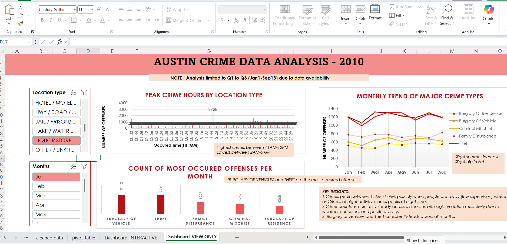
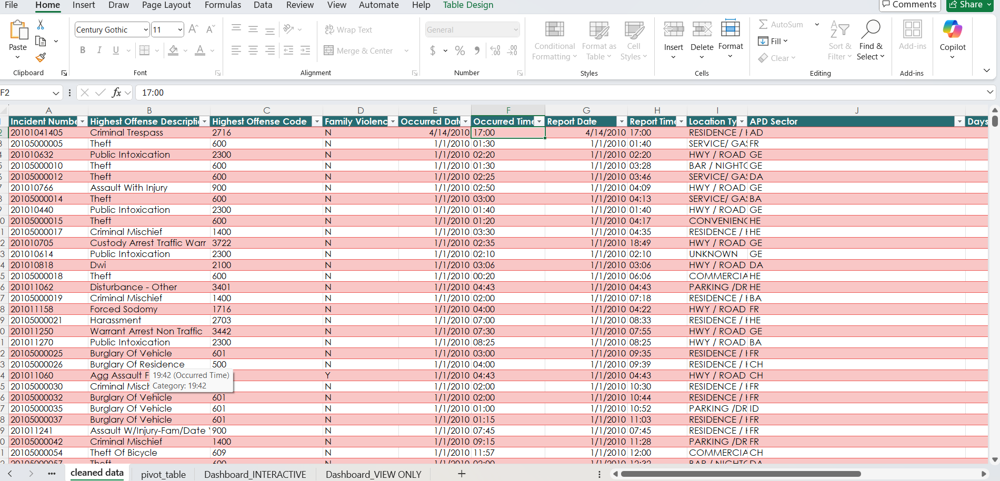
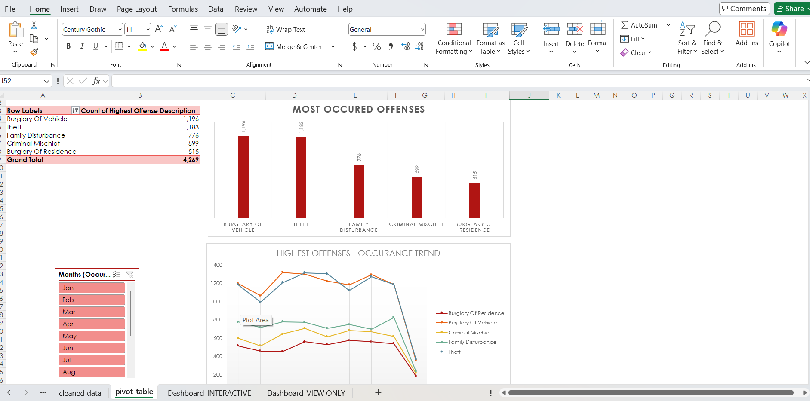

# Austin-crime-analysis-2010

## Project Overview
This is my first data analysis project using Excel. 
The project explores **Austin crime data-2010**to identify patterns and trends using dashboards and pivot tables.
Note: This analysis uses **partial data**, not complete data set.

## View Project
- [Interactive Excel workbook](https://1drv.ms/x/c/43a4bb5b1b38b739/IQBVQKjRga82R7Cl-c6rRtlfAZQuTxVs8q5xAXYYHYt9Xu4?e=Fh8GqU)
- Each worksheet in the workbook represents a step in the analysis process
- (original data,copied data,cleaned data,pivot table,interactive data,view only data)

## Data Source
- [Public dataset- Austin Crime Data (2010)](https://data.gov/)
- Partial records from Q1 to Q3
- Fields include crime type,location and time related information

## Tools Used
- Mcrosoft Excel
- Pivot Tables
- Pivot Charts
- Dashboards

## Key Insights
- Certain crime types occured more frequently than others
- Some areas showed higher crime concentration
- Crime frequency varied across time periods

## What I Learned
- How to clean and organize real-world data
- Using pivot tables to summarize large datasets
- Creating dashboards for basic data storytelling

## Next Steps
- Add charts and Screenshots from Excel
- Improve Dashboard clarity and learn Data visualization tools
- Analyze a more complete dataset in a future project

## Screenshots

### Dashboard

### Cleaned data

### Pivot Tables and Pivot charts

