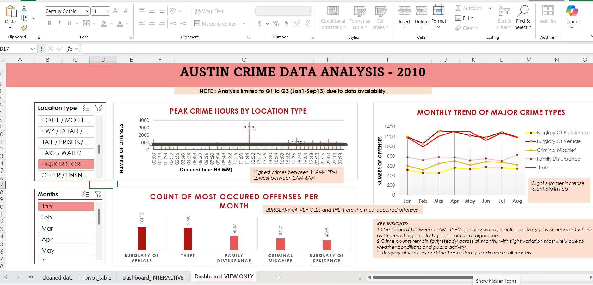

# Austin Crime Intelligence & Data Analysis Dashboard

**Transforming raw crime data into actionable insights using Excel, Power Query & Power BI**

> Note: This project uses a partial 2010 Austin Crime dataset (January – mid-September) sourced from Data.gov, used for learning and portfolio purposes only.

## At a Glance

- **Tools:** Excel (Pivot Tables/Charts) → Power Query (ETL) → Power BI (star schema, DAX, drill-through)
- **What it does:** Turns ~97,000 raw crime incident records into an interactive dashboard exploring crime category, geography (APD sector), location type, and time trends
- **Standout technical decision:** Migrated from a flat Excel table to a star schema (`Fact_Crime_Data` + `Dim_Date`, `Dim_Offense`) to support scalable DAX measures, drill-through pages, and dynamic tooltip visuals
- **Key finding:** Burglary was the most common offense (16.1K incidents, ~16.6% of total volume), followed by Theft/Larceny (13.8K) and Disturbance/Public Issues (11.8K) — together the top 3 categories account for roughly 43% of all incidents. Edward sector recorded the highest overall crime volume citywide.
- **View the original Excel analysis (interactive workbook):** [Open in Excel Online](https://1drv.ms/x/c/43a4bb5b1b38b739/IQBVQKjRga82R7Cl-c6rRtlfAZQuTxVs8q5xAXYYHYt9Xu4?e=Fh8GqU)
- **Power BI dashboard (live, interactive):** [View live report](your-publish-to-web-link-here)

*Main Power BI dashboard — see Dashboard Features below for drill-through and tooltip details.*

---

## Project Overview

Understanding crime patterns is essential for supporting informed decision-making in public safety. This project analyzes crime incident data from the City of Austin to uncover trends across crime categories, geographic locations, APD sectors, and time periods.

What began as a first Excel-based data analysis project evolved into a Power BI business intelligence solution — not a recreation of the Excel dashboard, but a full redesign of the analytical workflow incorporating data transformation, dimensional modeling, interactive reporting, and enhanced UX.

## Business Problem

Large crime datasets contain thousands of individual incident records, making it difficult to identify meaningful patterns through raw tables alone. This project aims to answer:

- Which crime categories occur most frequently?
- How does crime vary across APD sectors?
- Are certain months associated with higher crime activity?
- Which location types experience the highest number of incidents?
- How can users efficiently investigate crime patterns without manually filtering large datasets?

## Project Evolution

| Phase | Focus | Outcome |
|---|---|---|
| Phase 1 | Excel-based exploratory analysis | Cleaned data, pivot tables/charts, interactive dashboard to identify early trends |
| Phase 2 | Power BI business intelligence solution | Star schema model, Power Query transformations, DAX measures, interactive dashboard with drill-through |

Raw Dataset → Excel Exploration → Initial Cleaning → Power Query →
Star Schema Model → DAX Measures → Interactive Dashboard → Business Insights
## Data Source

Crime incidents reported in Austin from January to mid-September 2010, sourced from [Data.gov](https://data.gov). Each record includes offense description, incident date/time, APD sector, location type, and geographic coordinates. Because September is only partially represented, it's excluded from the monthly/trend charts to avoid skewing the visuals, but is still included in the overall total and average monthly incident figures.

---

## Phase 1: Exploratory Analysis in Excel

The dataset was first explored to understand structure, identify duplicates/incomplete records, and clean inconsistent values before analysis began. Explore the full interactive version here: [Open the Excel workbook](https://1drv.ms/x/c/43a4bb5b1b38b739/IQBVQKjRga82R7Cl-c6rRtlfAZQuTxVs8q5xAXYYHYt9Xu4?e=Fh8GqU) — each worksheet represents a step in the process (original data, cleaned data, pivot table, interactive dashboard, view-only dashboard).

*Excel dashboard with Location Type and Month slicers, built on raw (ungrouped) offense descriptions.*

Excel's Pivot Tables and Pivot Charts summarized crime frequency by raw offense description, peak crime hours, monthly trends, and distribution across location types — establishing the key metrics later refined and built into the Power BI model. Offenses weren't yet grouped into categories at this stage; that happened during the Power Query ETL step below.

**Phase 1 findings:**
- **Peak crime hours:** Incidents peak between 11 AM–12 PM (3,728 offenses in that window) and are lowest between 2–6 AM.
- **Top offenses:** Burglary of Vehicle (10,112) and Theft (9,940) lead consistently across all months, followed by Family Disturbance (6,257), Criminal Mischief (5,262), and Burglary of Residence (4,368).
- **Monthly trend:** Crime volume stays fairly steady month to month, with a slight summer increase and a slight dip in February.

**Skills demonstrated:** Data exploration, data cleaning, Pivot Tables, Pivot Charts, interactive dashboard design (slicers), EDA

## Phase 2: Data Transformation & Modeling

### Power Query (ETL, within Power BI)

Power Query — Power BI's built-in ETL tool — standardized formats, cleaned columns, grouped related offenses into broader analytical categories, and prepared the dataset for dimensional modeling. This is also where categorization first happened; the Excel phase worked with raw, ungrouped offense descriptions.

**Why categorize?** The raw data had many near-duplicate offense descriptions (e.g., multiple burglary variants). Grouping them improved reporting consistency, readability, and trend comparison — without losing the ability to drill into detail.

### Data Model — Star Schema

**Fact table: `Fact_Crime_Data`** — incident number, offense code, family violence indicator, occurred/report date & time, location type, APD sector, and calculated fields. *Occurred Date* was used as the primary date field to analyze when incidents actually happened (vs. when reported).

**Dimension tables:**
- `Dim_Date` — built from Occurred Date, enables monthly trend analysis
- `Dim_Offense` — standardized crime categories via Power Query grouping

**Measures table** — all DAX measures centralized separately from data tables for maintainability.

**Why star schema?** Cleaner relationships, easier DAX development, better dashboard performance, and a structure that scales.

*Star schema showing Fact_Crime_Data connected to Dim_Date and Dim_Offense.*

---

## Dashboard Features

- **Interactive crime analysis** — volume, trends over time, top categories, location and sector distribution
- **APD sector geographic analysis** — a dedicated map page comparing crime activity across sectors, built using a boundary map sourced from a public government site and a downloaded GeoJSON file for the APD sector shapes. Includes independent slicers for APD Sector Name, Offense Category, Month, and Location Type, so users can isolate any combination and see how crime distribution shifts geographically

*Dedicated APD Sector map page with slicers for Sector Name, Offense Category, Month, and Location Type.*

- **Drill-through** — from crime category or APD sector into detailed time/location/incident patterns
- **Drill-down** — hierarchical exploration without cluttering the main view
- **Dynamic DAX-driven titles** — update automatically to reflect active filter context (e.g., *"Detailed Analysis: Burglary • April"*)
- **Custom tooltips** — supporting insights on hover without adding visual clutter
- **Slicers & navigation** — month/sector filtering, plus a bookmark-based reset button

## Key DAX Measures

| Measure | Purpose |
|---|---|
| Total Number of Incidents | Dynamic incident count across all filter contexts |
| Percentage of Total Crime | Each category's share of overall volume |
| Average Monthly Incidents | Baseline for comparing activity across periods |
| Most Common Offense (TOPN) | Highest-incident category in current context |
| High-Crime APD Sector (TOPN) | Highest-volume sector in current context |
| Peak Hour (TOPN) | Hour with the most recorded incidents |
| Selected/Other Crimes Count | Powers the tooltip pie chart comparing selected category vs. all others |
| Drill-Through Page Title | Dynamic title using `SELECTEDVALUE()`, `HASONEVALUE()`, and `VAR` to reflect single vs. multi-selection context |

---

## Key Insights & Findings

- **Crime category:** Incidents are not evenly distributed across offense types. Burglary leads at 16.1K incidents (~16.6% of total volume), followed by Theft/Larceny (13.8K) and Disturbance/Public Issues (11.8K); together these top 3 categories account for roughly 43% of all recorded crime.
- **Time-based:** Crime activity varies by month, day of week, and hour. The daily trend shows incidents climbing from a Monday low toward a weekend peak, and the hourly trend shows a dip in early morning hours before rising through the afternoon into a late-evening peak (around 10 PM). Occurred Date was used as the primary date field to give a more accurate view of when incidents actually happened. Note: since the dataset only partially covers September 2010, that month is excluded from the monthly trend chart to avoid a misleading dip, but its incidents are still counted in the overall total and average monthly figures.
- **Geographic:** Incident volume varies meaningfully across APD sectors, with Edward recording the highest overall crime volume citywide. Drilling into individual sectors (e.g., David) shows ~13K total incidents with Burglary as the top offense, consistent with the citywide pattern. Residences were consistently the top peak location, with burglary alone showing 16.1K incidents at residences.

## Recommendations

Based on the patterns surfaced in the dashboard, a few directions worth exploring for public safety planning:

- **Prioritize patrol resourcing around Burglary and Theft/Larceny**, which together account for ~31% of incidents — the highest-leverage categories for driving down overall volume.
- **Increase visibility around residences**, the leading incident location by far (16.1K burglary incidents alone) — a strong candidate for targeted lighting, cameras, or neighborhood patrol checkpoints.
- **Align shift staffing with the daily/hourly trend**: incidents rise through the afternoon into a ~10 PM peak, and climb from a Monday low toward the weekend — suggesting evening and weekend coverage may offer more impact than a flat staffing model.
- **Give Edward sector a closer look**, since it carries the highest overall incident volume citywide — worth investigating whether that reflects population density, commercial activity, or another underlying driver before concluding it needs more resources per capita.

*(Framed as hypotheses the data supports — not policy conclusions, since this is a partial, single-year dataset used for portfolio purposes.)*

## Challenges & Solutions

**Large, flat dataset** → Redesigned as a star schema (see Data Model above) for better organization and performance.

**Numerous overlapping offense types** → Grouped into analytical categories during Power Query ETL (see above).

**Depth vs. dashboard clutter** → Solved with drill-through pages, tooltips, and dynamic titles (see Dashboard Features) instead of cramming detail into the main view.

**Partial final month (September)** → Including it in the monthly trend chart would've misrepresented the trend as a sharp drop-off, so it's excluded from trend visuals but still counted in the total and average monthly figures.

---

## Skills Demonstrated

**Data Analysis:** EDA, data cleaning, trend identification, analytical storytelling
**Excel:** Pivot tables/charts, interactive dashboard design, slicers
**Power Query:** Data transformation, category mapping, ETL workflow
**Power BI:** Star schema modeling, relationships, DAX, drill-through, custom tooltips, bookmarks/navigation
**Documentation:** GitHub project documentation, data storytelling

## Repository Structure

Austin-Crime-Analysis/
│
├── Excel_Phase1/
│   ├── Cleaned Dataset
│   ├── Screenshot_dashboard.png
│   ├── Screenshot_cleanedData.png
│   ├── Screenshot_pivotTable+chart_1.png
│   └── Screenshot_pivotTable+chart_2.png
│
├── PowerBI/
│   ├── Power BI Report (.pbix)
│   ├── Screenshot_dashboard.png
│   ├── Screenshot_dataModel.png
│   └── Screenshot_sectorMap.png
│
└── README.md

## Future Improvements

- Automate data refresh via scheduled pipelines
- Incorporate additional years for long-term trend analysis
- Add predictive analytics to forecast crime patterns
- Expand geographic analysis with additional spatial insights
- Include external factors that may influence crime trends

## Conclusion

This project demonstrates the evolution of a data analysis workflow from Excel-based exploration into a structured Power BI business intelligence solution — combining data preparation, dimensional modeling, DAX calculations, and interactive reporting to transform raw crime records into a user-friendly analytical dashboard.
